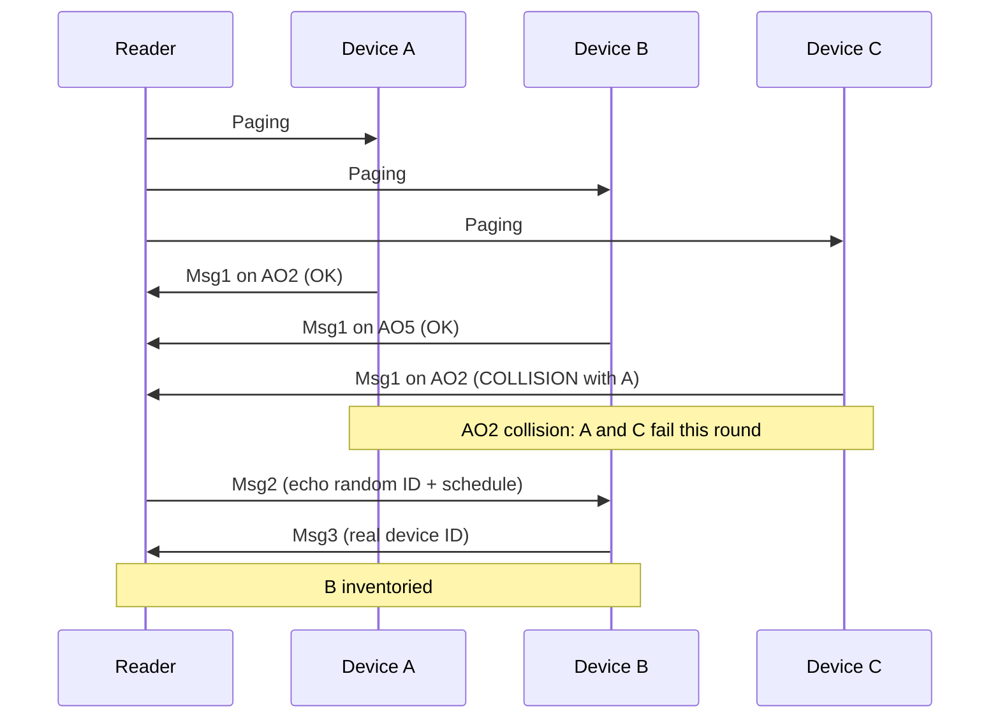

> **Nav** · [Figure notes](./README.md) · [TOC content.md](../content.md)

| | |
|---|---|
| Previous figure | _(this is the first figure)_ |
| Next figure | [Figure 2: EM energy state →](./figure-02-em-energy.md) |

---

# Figure 1: CBRA procedure (box-by-box)

Open **Figure 1** in the paper PDF and read this page beside it.

This figure is not a simulation result. It is:

> **A protocol diagram: in one inventory, how the Reader and multiple Devices talk using CBRA.**

After you finish this figure, you must be able to draw this chain yourself:

```text
Paging
  → Device picks an AO and sends Msg1
  → success / collision
  → Msg2 (only to the successful ones)
  → Msg3 (reports the real ID)
  → inventoried
```

---

## 1. Who is talking to whom?

The horizontal axis is usually:

> **Time**

Along the vertical direction you will see:

- messages sent by the **Reader**
- messages sent by several **Devices / Tags**
- several **AOs (Access Occasions)**

Remember the roles:

| Role | What they do |
|---|---|
| Reader | Call out, listen for Msg1, reply with Msg2, receive Msg3 |
| Device | Hear Paging, contend for an AO, send Msg1/Msg3 |
| AO | “In this time/frequency slot, only one device should shout” |

---

## 2. Step 1: Paging (R2D)

On the far left / top of the figure you usually see first:

> **Paging**

In plain English:

```text
Reader:
“HELLO ALL TAGS, INVENTORY STARTING!
If you are here, come do random access.”
```

Key points:

1. Paging is **R2D** (Reader → Device).
2. It **triggers** random access / CBRA.
3. Only Devices that are **awake, able to hear, and have enough energy** at that moment enter the rest of the procedure.

When you later write the simulation, the Paging instant is the “starting gun” of one CBRA round.

---

## 3. Step 2: many Devices try to reply with Msg1 at once

After Paging is received, it is not roll call in a queue. Instead:

> each Device **randomly picks one AO** and sends **Msg1** there.

Msg1 usually carries:

> a **temporary random ID** (the paper’s example often mentions 16-bit)

It is not the final device ID.

In plain English:

```text
Device A: “I request access, temporary ID 12345, I pick AO2”
Device B: “I request access, temporary ID 77881, I pick AO5”
Device C: “I request access, temporary ID 99012, I also pick AO2”   ← danger
```

---

## 4. What does an AO look like on the figure?

The figure draws a row of small slots (or a time × frequency grid):

```text
AO1  AO2  AO3  AO4  ...
```

Each slot has three common outcomes:

| Outcome | Typical meaning on the figure | Consequence |
|---|---|---|
| Empty | Nobody transmitted | Resource wasted, but no collision |
| Success / Occupied | Exactly one Device | The Reader can decode Msg1 |
| Collision | ≥2 Devices on the same AO | Msg1 fails; this round is wasted |

Figure 1 specifically marks a **collision AO**. Read it as:

```text
Two people talking to you at once:
“I am—I am—”
You understood neither of them.
```

---

## 5. Msg2: the Reader only answers the ones it heard clearly

For a **successful Msg1**:

```text
Reader → Device:
“Temporary ID 12345, I heard you.
Please send Msg3 on this resource.”
```

Note:

- Devices in a collision **do not receive a valid Msg2** (or equivalently: they fail this round).
- Msg2 is still **R2D**.
- Msg2’s job is: acknowledge + schedule the following Msg3 resource (the intuition of contention resolution / a grant).

---

## 6. Msg3: report the real identity

A Device that makes it to Msg3:

```text
Device → Reader:
“My real device ID is ABCDEFG.”
```

After this step succeeds:

> the Reader has **inventoried this device**.

The paper then assumes:

> that Device **leaves** the remaining inventory (it no longer contends for AOs).

That is why the Figure 5(b) curve is monotonically increasing: successful devices do not come back and interfere.

---

## 7. Draw Figure 1 as a timeline in your head



(The above is only a teaching sketch: who collides with whom on the real figure follows the paper.)

---

## 8. Eight questions you must be able to answer

After reading Figure 1, close the PDF and try to answer:

1. Who sends Paging to whom?
2. Why does inventory use CBRA instead of CFRA?
3. What do empty, success, and collision AOs each mean?
4. Why does Msg1 use a random ID first?
5. Does Msg2 go to Devices that collided?
6. When does a device count as “successfully inventoried”?
7. After success, does the Device keep contending in the next round? (paper assumption)
8. If there are 600 Devices and only 8 AOs, what does Figure 1’s world become?

If question 8 immediately makes you think **congestion / access probability / grouping**:

> you have already connected Figure 1 to the second half of the paper.

---

## 9. How this connects to the later simulation

When you reproduce Figure 5(b), **every Paging round** is basically repeating Figure 1:

```text
Who is awake?
→ Who belongs to this group?
→ Who passes the access probability?
→ Each picks an AO
→ Decide collision / success
→ Successful ones go through Msg2/Msg3
→ Is there enough energy to finish?
→ If success, mark inventoried
```

So:

> **Figure 1 = the protocol skeleton of the simulation main loop.**

---

## 10. Pass criterion for this figure

You should be able to explain this to someone else without looking at the paper:

> “The Reader pages first; devices randomly pick an AO and send Msg1; if several share an AO they collide and fail; only a successful Msg1 gets Msg2, then Msg3 reports the real ID; after that report succeeds, the device is inventoried.”


---

> **Nav**
>
> - [↑ Figure notes](./README.md)
> - [↑ TOC](../content.md)
> - _(this is the first figure)_
> - [Figure 2: EM energy state →](./figure-02-em-energy.md)
