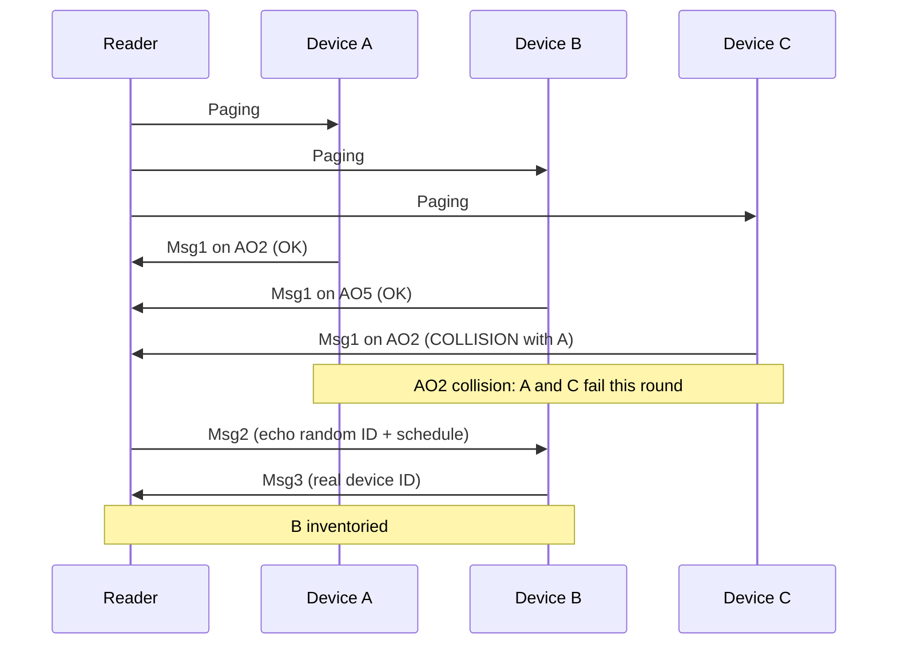

> **导航** · [逐图目录](./README.md) · [总目录 content.md](../content.md)

| | |
|---|---|
| 上一图 | _（已是第一张图）_ |
| 下一图 | [Figure 2：EM 能量状态 →](./figure-02-em-energy.md) |

---

# Figure 1：CBRA Procedure（逐框拆解）

打开论文 PDF 里的 **Figure 1**，对照本页。

这张图不是仿真结果，而是：

> **协议示意图：一次 inventory 里，Reader 和多个 Device 怎么用 CBRA 说话。**

你读完这张图，必须能自己画出下面这条链：

```text
Paging
  → Device 选 AO 发 Msg1
  → 成功 / collision
  → Msg2（只给成功的）
  → Msg3（报真正 ID）
  → inventoried
```

---

## 1. 图在说谁和谁？

横轴通常是：

> **Time（时间）**

纵轴方向上会看到：

- **Reader** 发出的消息
- 多个 **Device / Tag** 发出的消息
- 若干 **AO（Access Occasion）**

记住角色：

| 角色 | 干什么 |
|---|---|
| Reader | 喊人、听 Msg1、回 Msg2、收 Msg3 |
| Device | 听 Paging、抢 AO、发 Msg1/Msg3 |
| AO | “这个时间/频率格子里，只该有一个人喊” |

---

## 2. 第一步：Paging（R2D）

图的最左边 / 最上方通常先有：

> **Paging**

人话：

```text
Reader:
“HELLO ALL TAGS, INVENTORY STARTING!
谁在这里，来随机接入。”
```

关键点：

1. Paging 是 **R2D**（Reader → Device）。
2. 它 **触发** random access / CBRA。
3. 只有当时 **醒着、听得到、能量够** 的 Device 才会进入后续流程。

如果你之后写仿真，Paging 时刻就是一轮 CBRA 的“发令枪”。

---

## 3. 第二步：多个 Device 同时想回 Msg1

收到 Paging 后，不是排队点名，而是：

> 每个 Device **随机选一个 AO**，在那里发 **Msg1**。

Msg1 里通常带：

> **临时 random ID**（论文例子常提 16-bit）

不是最终 device ID。

人话：

```text
Device A: “我申请接入，临时号 12345，我选 AO2”
Device B: “我申请接入，临时号 77881，我选 AO5”
Device C: “我申请接入，临时号 99012，我也选 AO2”   ← 危险
```

---

## 4. AO 在图上长什么样？

图里会画出一排（或时间×频率网格）小格子：

```text
AO1  AO2  AO3  AO4  ...
```

每个格子三种常见结局：

| 结局 | 图上常见含义 | 后果 |
|---|---|---|
| Empty | 没人发 | 资源浪费，但无碰撞 |
| Success / Occupied | 恰好一个 Device | Reader 能解码 Msg1 |
| Collision | ≥2 个 Device 同 AO | Msg1 失败，本轮作废 |

Figure 1 专门会标出一个 **collision AO**。把它理解成：

```text
两个人同时对你说话：
“我是—我是—”
你一个都没听懂。
```

---

## 5. Msg2：Reader 只回答“听清的人”

对 **成功的 Msg1**：

```text
Reader → Device:
“临时号 12345，我听到了。
请按这个资源发 Msg3。”
```

注意：

- Collision 的 Device **收不到有效 Msg2**（或等价地：本轮失败）。
- Msg2 仍是 **R2D**。
- Msg2 的作用是：确认 + 安排后续 Msg3 资源（contention resolution / grant 的直觉）。

---

## 6. Msg3：真正报上身份

成功走到 Msg3 的 Device：

```text
Device → Reader:
“我的真正 device ID 是 ABCDEFG。”
```

这一步成功后：

> Reader 才算 **inventory 了这个设备**。

之后论文假设：

> 该 Device **退出**后续 inventory（不再抢 AO）。

所以 Figure 5(b) 的曲线才会单调往上走：已成功的人不再回来捣乱。

---

## 7. 把 Figure 1 画成你脑子里的时序



（上面只是教学示意：真实图里谁撞谁以论文为准。）

---

## 8. 你必须能回答的 8 个问题

读完 Figure 1，合上 PDF，试着回答：

1. Paging 是谁发给谁的？
2. 为什么 inventory 用 CBRA 而不是 CFRA？
3. AO 空着、成功、碰撞分别意味着什么？
4. Msg1 为什么先用 random ID？
5. Msg2 会发给 collision 的 Device 吗？
6. 什么时候才算“成功 inventory”？
7. 成功后 Device 还会继续抢下一轮吗？（论文假设）
8. 若 600 个 Device、只有 8 个 AO，Figure 1 的世界会变成什么样？

如果第 8 题你立刻想到 **congestion / access probability / grouping**：

> 你已经把 Figure 1 接到论文后半部分了。

---

## 9. 和后面仿真的关系

复现 Figure 5(b) 时，**每一轮 Paging** 基本都在重复 Figure 1：

```text
谁醒着？
→ 谁属于本 group？
→ 谁通过 access probability？
→ 各自选 AO
→ 判 collision / success
→ 成功者走 Msg2/Msg3
→ 能量是否够走完
→ 成功则标记 inventoried
```

所以：

> **Figure 1 = 仿真主循环的协议骨架。**

---

## 10. 本图过关标准

你可以不看论文，向别人讲清楚：

> “Reader 先 paging；设备随机挑 AO 发 Msg1；同 AO 多人则碰撞失败；只有 Msg1 成功的才收到 Msg2，再发 Msg3 报真实 ID；报成功后就算被 inventory。”


---

> **导航**
>
> - [↑ 逐图目录](./README.md)
> - [↑ 总目录](../content.md)
> - _（已是第一张图）_
> - [Figure 2：EM 能量状态 →](./figure-02-em-energy.md)
